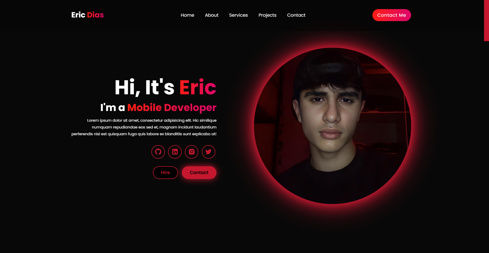

# 🚀 Portfólio de Eric Dias - Desenvolvedor Mobile



## ✨ Visão Geral

Este é um site de portfólio pessoal moderno e responsivo que apresenta minhas habilidades, serviços e projetos como desenvolvedor mobile. O site foi criado com HTML, CSS e JavaScript para mostrar meu trabalho e facilitar o contato com potenciais clientes e empregadores.

## 🛠️ Tecnologias Utilizadas

- **HTML5** - Estrutura do site
- **CSS3** - Estilização e animações
- **JavaScript** - Interatividade
- **Boxicons** - Ícones elegantes
- **Google Fonts (Poppins)** - Tipografia

## 🔍 Características Principais

- ✅ **Design Responsivo** - Adaptável a dispositivos móveis, tablets e desktops
- ✅ **Menu de Navegação** - Com toggle para dispositivos móveis
- ✅ **Seções Intuitivas** - Home, Sobre, Serviços, Projetos e Contato
- ✅ **Efeitos Visuais** - Animações suaves e efeitos de hover atrativos
- ✅ **Formulário de Contato** - Para potenciais clientes entrarem em contato facilmente
- ✅ **Paleta de Cores** - Design com gradientes vermelho e preto para destaque visual
- ✅ **Integração de Mídias Sociais** - Links para GitHub, LinkedIn, Instagram e Twitter

## 📱 Layout Responsivo

O site foi desenvolvido com foco em experiência mobile-first, garantindo uma navegação suave em qualquer dispositivo:

- **Desktop** - Layout completo com todas as funcionalidades
- **Tablet** - Adaptação de elementos para melhor visualização
- **Mobile** - Menu recolhível e reorganização de seções para telas pequenas

## 📂 Estrutura do Projeto

```
portfolio-website/
│
├── index.html       # Estrutura principal do site
├── style.css        # Estilos e responsividade
├── script.js        # Funcionalidades interativas
├── home_image.png   # Imagem principal do perfil
└── servblu.png      # Imagem do projeto destacado
```

## 🎬 Inspiração e Créditos

Este projeto foi desenvolvido seguindo o tutorial:
- **"Build a Responsive Personal Portfolio Website Using HTML & CSS & JavaScript"**
- **URL:** [Assista ao tutorial no YouTube](https://www.youtube.com/watch?v=uTPO6fKtBvM)

## 📞 Contato

Para mais informações, entre em contato através do formulário no site ou pelas redes sociais listadas.

---
